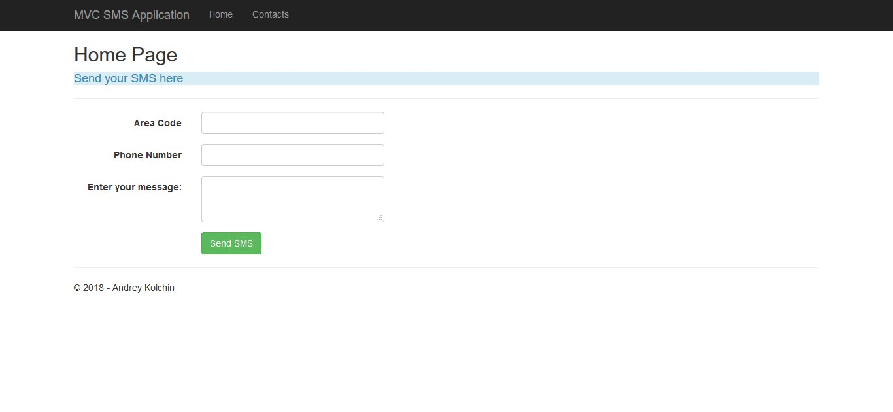
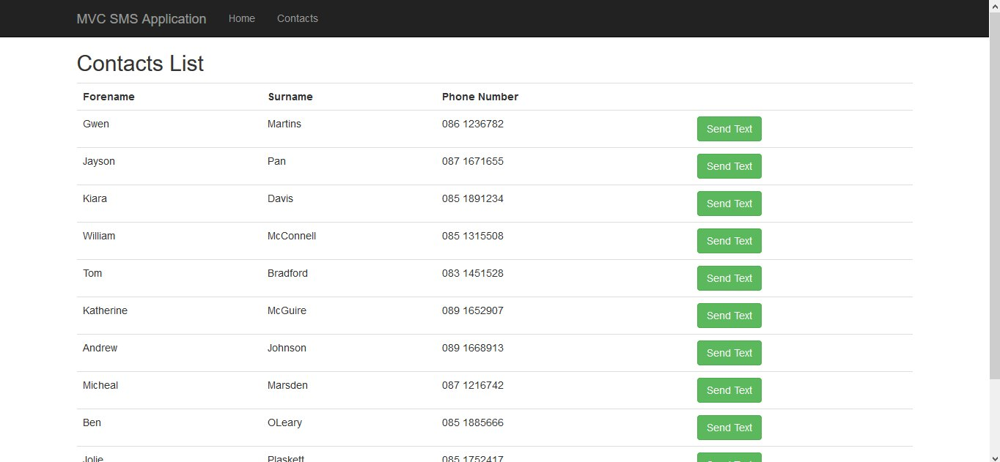
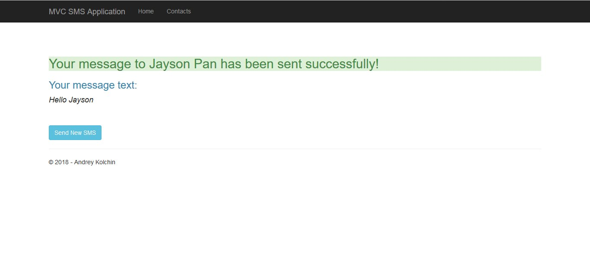
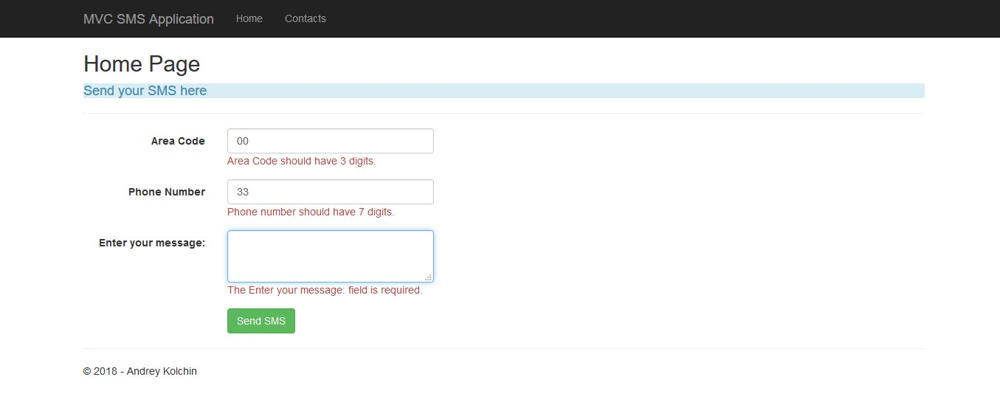
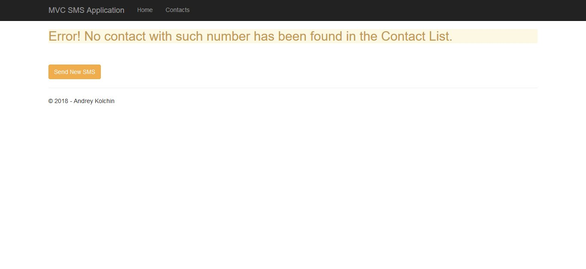

# CSharp-.NET-MVCApp
ASP.NET MVC Application
## Description
Simple ASP.NET MVC Application to send SMS texts to saved persons.
## Screenshots

## Overview
- An example of [ASP.NET MVC Application](https://www.asp.net/mvc) to show some basic functionality of sending an SMS text message to a person from saved list of contacts

- A mock database had been used, that could be replaced by actual database to save contacts data

- Actual method to send SMS hasn't been implemented, only a message displayed on the screen

- Validation for user input

- Project includes Test cases to check models validation and controllers

## Built using
* [Visual Studio 2015](https://www.visualstudio.com/)

